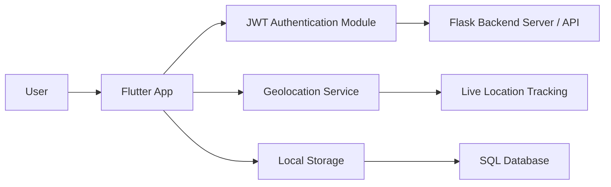

<h1 align="center">
  <a href="https://github.com/MaitryS07/Raksha-Safeher">
    Raksha-Safeher
  </a>
  <br>
  Women Safety Application – Smart SOS & Emergency Support
</h1>

<div align="center">
By Team SafeHer
</div>
<hr>

<details>
<summary>Table of Contents</summary>

- [Description](#description)
- [Links](#links)
- [Tech Stack](#tech-stack)

- [Progress](#progress)
- [Future Scope](#future-scope)
- [Applications](#applications)
- [Project Setup](#project-setup)
- [Team Members](#team-members)
- [Mentors](#mentors)

</details>

---

## 📝 Description

**Raksha-Safeher** is a women-safety mobile application designed to provide instant emergency support through a **one-tap SOS alert**, **live location sharing**, and **trusted contacts notifications**.  
The app helps users register, authenticate securely, manage SOS contacts, and quickly send alerts during unsafe situations.  
Its goal is to offer real-time assistance, fast communication, and enhanced personal safety using modern technologies.

---

## 🔗 Links

- **GitHub Repository:** https://github.com/MaitryS07/Raksha-Safeher  
- **Demo Video:** _Coming Soon_  
- **Screenshots Folder:** _To be added_  
- **Hosted Website:** _Not hosted yet_

---

## 🤖 Tech-Stack

### **Front-end**
- Flutter (Android / iOS support)

### **Backend**
- Flask  
- JWT Authentication  

### **Utilities / APIs**
- Twilio API (for SMS sending & emergency calling)  
- MobileBERT (Transformer model for safety-based predictions)

### **Database**
- MySQL / SQL-based storage

---

## 🏗️ System Architecture



---

## 📈 Progress

### ✔️ Fully Implemented Features

- **User Registration & Login**  
  Secure authentication using OTP + JWT.

- **Live Location Tracking**  
  Geolocation-based real-time coordinate tracking.

- **One-Tap SOS Button**  
  Instantly alerts trusted contacts through APIs.

---

## 🚧 Partially Implemented Features / Work in Progress

- App does not work in background  
- App needs multilingual support  
- Safety routes feature is still under development  

---

## 🔮 Future Scope

- AI-based behavioral threat detection  
- Auto-dial nearest women helpline / police  
- Chatbot for safety instructions  
- Multi-language support  
- iOS app release (Flutter cross-platform)  
- Offline emergency alert system  

---

## 💸 Applications

- **Women Safety & Emergency Response:**  
  Instant alerts during unsafe situations.

- **Location-Based Assistance:**  
  Helps friends, family, or authorities track user's location.

- **College & Corporate Safety Programs:**  
  Useful for institutions committed to women's safety.

---

## 🛠 Project Setup

### 1️⃣ Clone the Repository

```bash
git clone https://github.com/MaitryS07/Raksha-Safeher
```

---

### 2️⃣ Open the Project

- Open in **VS Code** or **Android Studio**
- Ensure **Flutter SDK** is installed
- Run:

```bash
flutter pub get
```

---

### 3️⃣ Run the App

```bash
flutter run
```

---

### 4️⃣ Configure Backend (Flask)

**Install dependencies:**

```bash
pip install -r requirements.txt
```

**Start the Flask server:**

```bash
python app.py
```

---

### 5️⃣ Configure APIs

- Set **Twilio API Keys**
- Configure **JWT backend URL**
- Ensure **location permissions** are enabled

---

## 👨‍💻 Team Members

- Maitry Santoshwar – https://github.com/MaitryS07

- Abhay Munnjewar - https://github.com/AbhayMunjewar

- Vardhan Mali - https://github.com/vardhan01mali

- Samiksha Chaudhari - https://github.com/Samii2116

---

## 👨‍🏫 Mentors

- Ronit Chaube

- Om Mukharjee
